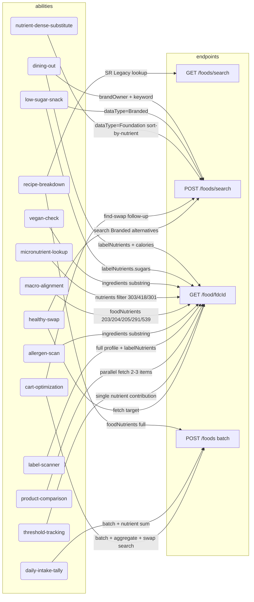

# USDA FoodData Central — Ability ↔ Endpoint Graph

## Merge-visualization note

`A4 (vegan-check)` and `A9 (allergen-scan)` both have **exactly one outbound edge → E3** and both read only the `ingredients` field with the same substring-scan parse. Per iron law #1 they MERGE into `usda-fdc-ingredient-compliance`.

All other ability pairs either hit a different endpoint set OR read different response fields OR apply a different parse strategy, so they remain separate per the strict merge rule.
